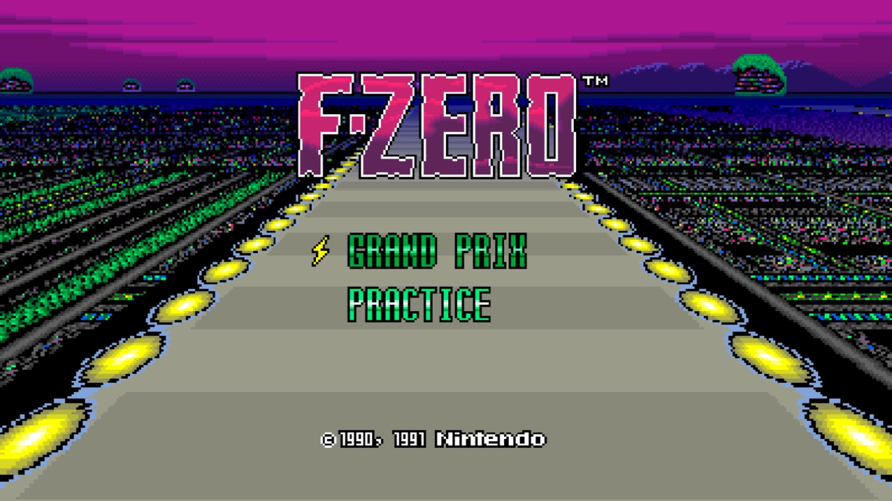
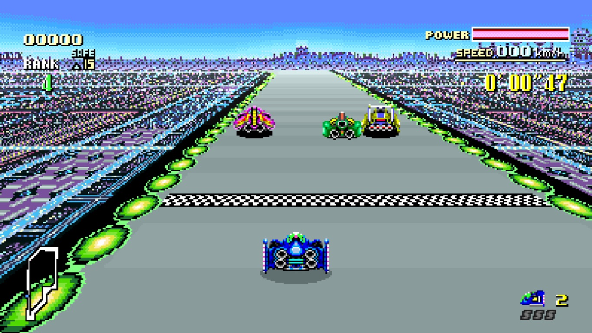
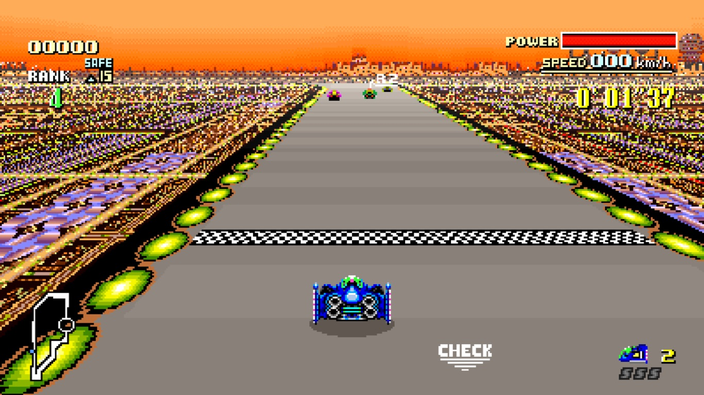

# F-Zero Recomp

A native, widescreen, static recompilation of F-Zero (USA).

You supply your own cartridge dump. No ROM is included; generated C is not
part of the source repository.

<p align="center">
  <a href="assets/screenshots/title-screen.jpg"></a>
  <a href="assets/screenshots/mute-city-i-start.jpg"></a>
  <a href="assets/screenshots/mute-city-ii-start.jpg"></a>
</p>

## Status and features

Most of the game has been tested on macOS with Apple Silicon. Windows x64 now
builds with MSVC and passes the synthetic host, graphics, and raster tests,
including GPU readback on Intel Iris Xe. Linux builds are not yet verified.
Development is ongoing; not every course, vehicle, or game situation is covered.

- Optional 16:9 widescreen
- Enhanced visual filters
- Keyboard and gamepad input, audio, and persistent saves
- ROM picker with identity verification
- In-game display, audio, and input settings

Filters use SDL 3.4 or newer's GPU renderer: Metal on macOS, or Direct3D 12
with Shader Model 6.0 on Windows. Other renderers retain Original colours and
support widescreen. Unsupported game layouts use the native view.

## ROM requirements

Use a **headerless F-Zero (USA)** cartridge dump for code generation:

| Property | Value |
| --- | --- |
| Size | 524,288 bytes |
| Mapping | LoROM |
| SHA-256 | `bf16c3c867c58e2ab061c70de9295b6930d63f29f81cc986f5ecae03e0ad18d2` |

The launcher also accepts the same payload with a 512-byte copier header.

## Download and install

The [latest release](https://github.com/craigshaw/FZeroRecomp/releases/latest)
includes a Mac app for **Apple Silicon (M1 or newer), macOS 13 or newer**.
SDL is bundled; no Homebrew, compiler, or code generation is needed.
Intel Macs are not supported by this download. Windows downloads will follow.

1. Download `FZeroRecomp-v0.1.0-macOS-arm64.zip` from the release's **Assets**.
2. Extract the ZIP and drag **F-Zero Recomp.app** into **Applications**.
3. Open the app, select your F-Zero (USA) ROM, and press **Play**.

The app is not signed with an Apple Developer ID or notarised. If macOS blocks
it, attempt to open it once, then go to **System Settings > Privacy & Security >
Open Anyway**. See [Apple's instructions](https://support.apple.com/en-gb/102445).

Saves and settings are stored in `~/Library/Application Support/FZeroRecomp/`.
To update, quit the app and replace it with the new download. Keep that data
folder to preserve your saves. To bring a save from a source build, quit both
copies and copy `build/saves/save.srm` to `saves/save.srm` in that folder;
back up an existing save before replacing it.

## Build from source

Requirements: Git, Python 3.11+, CMake 3.20+, Ninja, C11/C++17 compilers, SDL3
development files, and OpenGL development files. On macOS, Apple's Command Line
Tools provide the compilers and OpenGL SDK; Homebrew can supply the other tools:

```sh
brew install cmake ninja python sdl3
```

Clone the project, then place your headerless dump at `fzero_usa_reference.sfc`
in the project directory before generation:

```sh
git clone https://github.com/craigshaw/FZeroRecomp.git
cd FZeroRecomp
git submodule update --init
sh tools/apply_snesrecomp_patches.sh
python3 snesrecomp/tools/v2_sync_funcs_h.py --cfg-dir config --out config/funcs.h
python3 snesrecomp/tools/v2_emit.py --rom fzero_usa_reference.sfc --cfg-dir config --out-dir generated --cfg-roots
sh build.sh
./build/fzero_recomp
```

Choose the ROM in the launcher and press Play. Its path is remembered. To skip
the launcher for one run, pass a ROM path:

```sh
./build/fzero_recomp "/path/to/F-Zero (USA).sfc"
```

### Windows (native x64 MSVC)

Install Git for Windows, Python 3.11+, and Visual Studio Build Tools with the
C++ x64 workload, Windows SDK (including `dxc.exe`), and CMake tools for Windows.
The script discovers the compiler environment, restores pinned SDL3 through
vcpkg, verifies your ROM, generates C, compiles the visual filters, and builds
the game and tests. Run from ordinary PowerShell:

```powershell
.\build.ps1 -RomPath "C:\path\to\F-Zero (USA).sfc"
.\build\windows-msvc-x64-release\fzero_recomp.exe
```

Use `-SkipGenerate` for later host/shader edits, `-SkipSubmoduleUpdate` when
the pinned submodules are already present, and `-Fresh` to reconfigure CMake
(requires CMake 3.24+). `FZERO_ROM` can supply the ROM path instead of `-RomPath`.
For generation alone, run `tools\regenerate.ps1 -RomPath "C:\path\to\F-Zero (USA).sfc"`.

Build output, including `SDL3.dll` and launcher assets, is under
`build\windows-msvc-x64-release\`. DXIL shader bytecode is embedded in the
executable; there are no loose shaders or runtime shader compiler dependencies.
Dependency caches stay under ignored `.tools/` and build directories.

### Windows release ZIP

After building, run:

```powershell
python tools/package_windows.py --version 0.1.0
```

The packager runs CTest and GPU presentation checks (brief test windows appear),
stages only program files and notices, resolves x64 SDL/Visual C++ runtime
dependencies, and tests ROM rejection with a clean PATH. A GPU supporting the
filter path is required on the packaging machine. The ZIP and SHA-256 file are
written under `build-release/v0.1.0-windows-x64/`. Existing output is never
overwritten; use `--output` to select a new directory for a subsequent build.

To play, extract the entire ZIP to a writable folder and open
`fzero_recomp.exe`. Windows 10/11 x64 is the intended target; no development
tools or separate SDL installation are required. Keep the executable, DLLs,
and assets together. Settings and saves stay alongside the executable, so
preserve `config.ini`, `keybinds.ini`, `rom.cfg`, and `saves/` when updating.
The ZIP contains no ROM, generated C, recordings, or user data.

## Controls and settings

| Control | Keyboard |
| --- | --- |
| D-pad | Arrow keys |
| A / B / X / Y | X / Z / S / A |
| L / R | Q / E |
| Start / Select | Enter / Backspace |
| Settings | F1 |
| FPS readout | F |
| Quit, with settings closed | Esc |

Connect a gamepad before launch and select Gamepad as the input source. The
host uses the first available pad, with standard SNES button positions and
D-pad or left-stick steering. Custom physical pad bindings and pad selection
are not implemented. Keyboard bindings can be changed in the launcher's
Controller page and are loaded when you press Play.

F1 or gamepad Select+Start opens settings and pauses gameplay and audio.
**Display** contains Widescreen, Visual Style, and FPS Readout. The launcher's
generic save-state, rewind, and reset shortcuts are not connected to this host.

For source builds, keep the executable and its `assets/` folder together in a
writable directory.
Settings live beside the executable: `config.ini`, `keybinds.ini`, and `rom.cfg`.
SRAM is saved to `saves/save.srm` on normal exit. Close the game before renaming
a settings file to restore its defaults; leave the save file in place.

If the ROM is rejected, check its region, size, and hash. If CMake cannot find
SDL3, install its development files and set `SDL3_DIR` to the folder containing
`SDL3Config.cmake`. If input does not respond, check the selected input source.

## Development

See [architecture](docs/ARCHITECTURE.md) and [dependency patches](docs/SNESRECOMP_PATCHES.md).
After generation, maintainers can build the Mac release with
`python3 tools/package_macos.py --version 0.1.0`. This downloads and verifies
SDL source, builds it for macOS 13, runs CTest, and writes the app, ZIP, and
checksum under `build-release/`.

Report bugs with the platform, build revision, settings, and reproduction steps.
Do not attach ROMs or generated game code.

## Development disclosure

AI coding assistants have contributed to the runtime, tooling, testing, and
documentation under the maintainer's direction and review.

## Credits and licence

Built on [snesrecomp](https://github.com/RetroPortingToolKit/snesrecomp),
[recomp-ui](https://github.com/mstan/recomp-ui), and the projects credited by
those dependencies. See [third-party notices](docs/THIRD_PARTY_NOTICES.md).

Original code in this repository uses the [PolyForm Noncommercial License 1.0.0](LICENSE).

Required Notice: Copyright (c) 2026 Craig Shaw

Third-party code retains its respective licences. The ROM, generated game code,
and game artwork are not covered by the project licence. The gameplay screenshots
illustrate the project; the artwork shown belongs to its respective rights holders.
This project is not affiliated with or endorsed by Nintendo. *F-Zero* and its
related names and assets belong to their respective owners.
