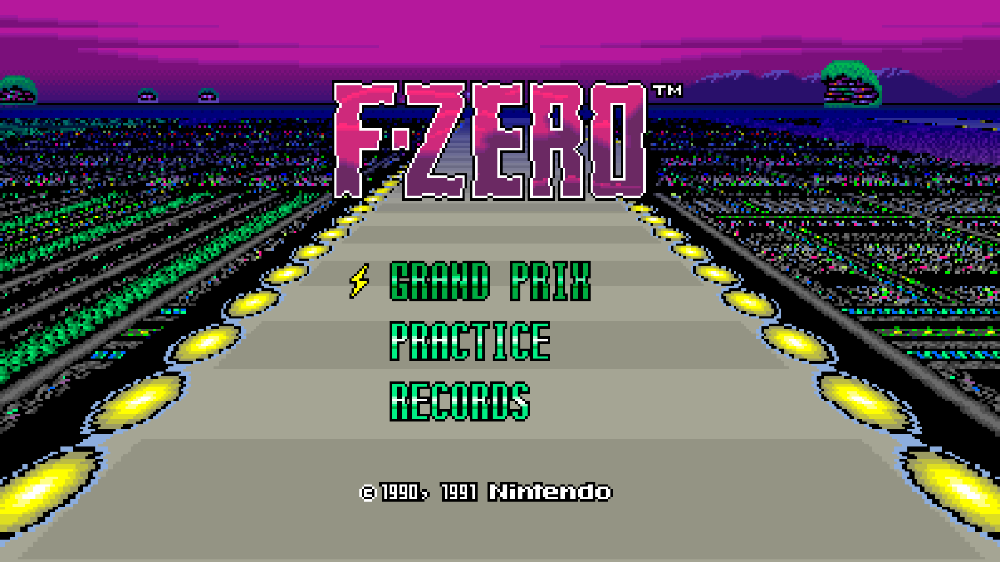
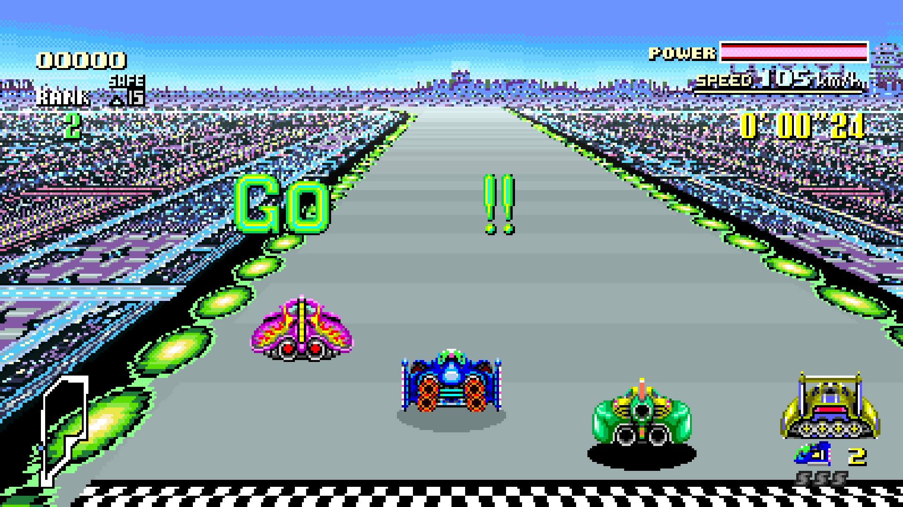
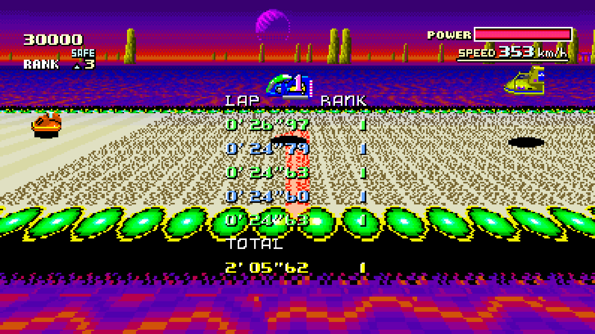
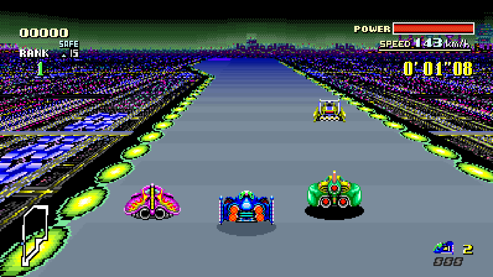
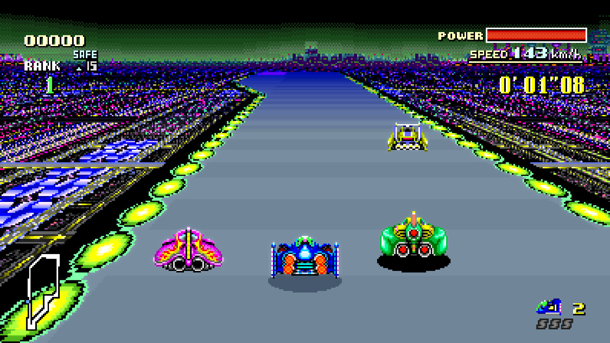
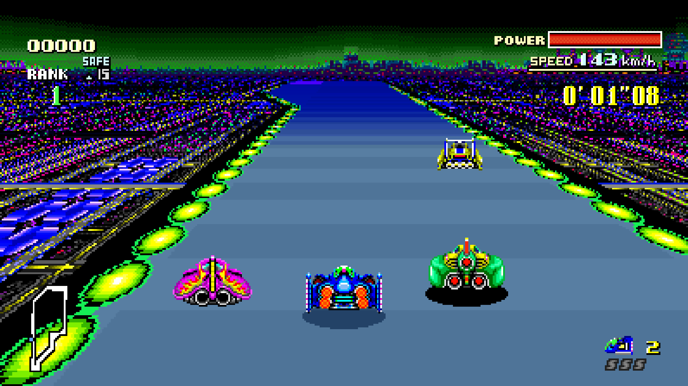
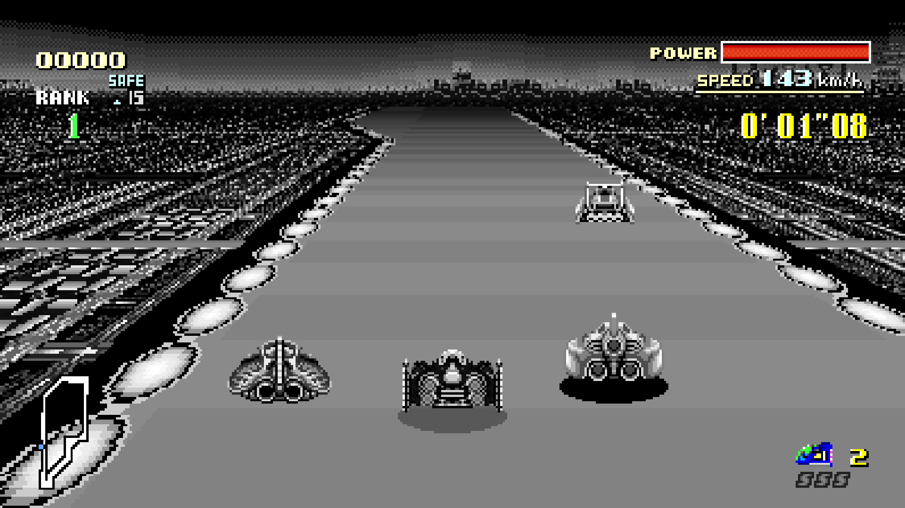
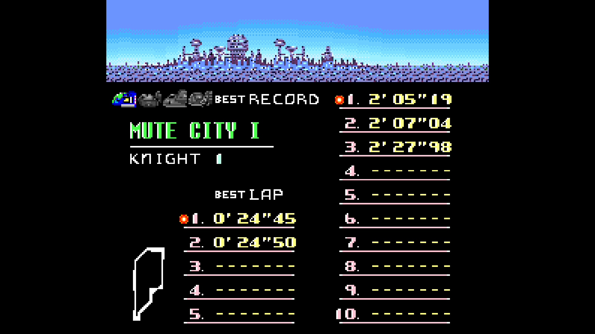
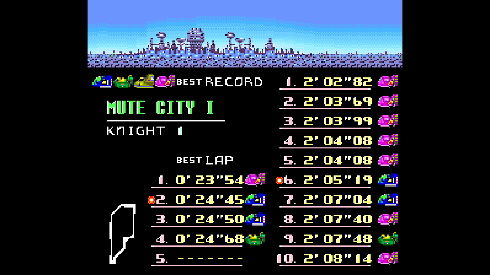

# F-Zero Recomp

A native, widescreen, static recompilation of F-Zero (USA).

You supply your own cartridge dump. No ROM is included; generated C is not
part of the source repository.

<p align="center">
  <a href="assets/screenshots/title-screen.png"></a>
  <a href="assets/screenshots/mute-city-i-start.png"></a>
  <a href="assets/screenshots/ws1.png"></a>
</p>

## Status and features

F-Zero Recomp is well tested on macOS (Apple Silicon) and Windows (x64).
It brings full widescreen racing, enhanced visuals, and expanded records
to the original game.

- **Full 16:9 widescreen racing.** See more of the track and surrounding
  scenery, with the race HUD positioned for the wider view. The original
  aspect ratio is also available.

- **Enhanced visual filters.** Choose Enhanced or Vivid for richer colours,
  Black & White for a different look, or Original to retain the game's
  original colours. Change your visual settings while playing.

- **Extended records for every car.** Track your ten best race times and
  five best laps for each car on all 15 tracks. Switch between individual
  car leaderboards and a combined leaderboard, with car icons and flashing
  markers highlighting your new records. Existing records are imported,
  and saves remain compatible with the original game.

Linux builds are not yet verified.

### Visual filters

The same frame on Mute City III, just after the start with all four cars in
view. Each screenshot is captured at 1920 × 1080. The HUD retains its original
colours in every mode. Click an image to view it at full size.

| Original | Enhanced |
| :---: | :---: |
| [](assets/screenshots/mute-city-iii-original.png) | [](assets/screenshots/mute-city-iii-enhanced.png) |
| **Vivid** | **Black & White** |
| [](assets/screenshots/mute-city-iii-vivid.png) | [](assets/screenshots/mute-city-iii-black-and-white.png) |

### Extended records

<p align="center">
  <a href="assets/screenshots/records1.png"></a>
  <a href="assets/screenshots/records2.png"></a>
  <br>
  <em>Individual car records (left) and combined records (right).</em>
</p>

## ROM requirements

Use a **headerless F-Zero (USA)** cartridge dump for code generation:

| Property | Value |
| --- | --- |
| Size | 524,288 bytes |
| Mapping | LoROM |
| SHA-256 | `bf16c3c867c58e2ab061c70de9295b6930d63f29f81cc986f5ecae03e0ad18d2` |

The launcher also accepts the same payload with a 512-byte copier header.

## Download and install

The [0.3.0 release](https://github.com/craigshaw/FZeroRecomp/releases/tag/v0.2.0)
is available for Windows and macOS. Both downloads bundle SDL; no compiler
or code generation is needed to play. You supply your own F-Zero (USA) ROM.

| Platform | Download | Requirements |
| --- | --- | --- |
| Windows | [Windows x64 ZIP (0.3.0)](https://github.com/craigshaw/FZeroRecomp/releases/download/v0.3.0/FZeroRecomp-v0.3.0-Windows-x64.zip) | Windows 10/11 x64; Direct3D 12 with Shader Model 6.0 for visual filters |
| macOS | [Apple Silicon ZIP (0.3.0)](https://github.com/craigshaw/FZeroRecomp/releases/download/v0.3.0/FZeroRecomp-v0.3.0-macOS-arm64.zip) | Apple Silicon (M1 or newer), macOS 13 or newer; Intel Macs are not supported |

### Windows

1. Download the Windows x64 ZIP and extract the entire archive to a writable
   folder, such as a folder under your user account. Do not run it inside the ZIP.
2. Open `fzero_recomp.exe`, select your F-Zero (USA) ROM, and press **Play**.
3. Press **F1** in game to change widescreen, visual style, audio, and input settings.

Keep the executable, DLLs, and `assets/` folder together. SDL and the Visual C++
runtime are included; no separate runtime installation is needed. If the GPU
cannot run the filters, the game uses Original colours and still supports widescreen.

Settings and saves live beside the executable: `config.ini`, `keybinds.ini`,
`rom.cfg`, and `saves/save.srm`. Keep that folder writable. To update, quit the
game, back up these files, and replace the program files with the new download
while preserving your settings, `saves/`, and `screenshots/` folders. Existing
settings take precedence over the new first-boot defaults. The release includes
a `.zip.sha256` checksum file for each download.

To use an existing battery save, select **Import** in the launcher and choose
your `.srm` or `.sav` file. A confirmation appears when the import succeeds;
press **Play** to load it. Import creates the saves folder on first use and
backs up an existing save as `saves/save.srm.bak` before replacing it.

### macOS

1. Download `FZeroRecomp-v0.2.0-macOS-arm64.zip` from the release's **Assets**.
2. Extract the ZIP and drag **F-Zero Recomp.app** into **Applications**.
3. Open the app, select your F-Zero (USA) ROM, and press **Play**.

The app is not signed with an Apple Developer ID or notarised. If macOS blocks
it, attempt to open it once, then go to **System Settings > Privacy & Security >
Open Anyway**. See [Apple's instructions](https://support.apple.com/en-gb/102445).

Saves and settings are stored in `~/Library/Application Support/FZeroRecomp/`.
To update, quit the app and replace it with the new download. Keep that data
folder to preserve your saves. To bring a save from a source build, quit both
copies and copy `build/saves/save.srm` to `saves/save.srm` in that folder;
back up an existing save before replacing it.

## Build from source

Visual filters use SDL 3.4 or newer's GPU renderer: Metal on macOS, or
Direct3D 12 with Shader Model 6.0 on Windows. Other renderers retain Original
colours and support widescreen.

Requirements: Git, Python 3.11+, CMake 3.20+, Ninja, C11/C++17 compilers, SDL3
development files, and OpenGL development files. On macOS, Apple's Command Line
Tools provide the compilers and OpenGL SDK; Homebrew can supply the other tools:

```sh
brew install cmake ninja python sdl3
```

Clone the project, then place your headerless dump at `fzero_usa_reference.sfc`
in the project directory before generation:

```sh
git clone https://github.com/craigshaw/FZeroRecomp.git
cd FZeroRecomp
git submodule update --init
sh tools/apply_snesrecomp_patches.sh
python3 snesrecomp/tools/v2_sync_funcs_h.py --cfg-dir config --out config/funcs.h
python3 snesrecomp/tools/v2_emit.py --rom fzero_usa_reference.sfc --cfg-dir config --out-dir generated --cfg-roots
sh build.sh
./build/fzero_recomp
```

Choose the ROM in the launcher and press Play. Its path is remembered. To skip
the launcher for one run, pass a ROM path:

```sh
./build/fzero_recomp "/path/to/F-Zero (USA).sfc"
```

### Windows (native x64 MSVC)

Install Git for Windows, Python 3.11+, and Visual Studio Build Tools with the
C++ x64 workload, Windows SDK (including `dxc.exe`), and CMake tools for Windows.
The script discovers the compiler environment, restores pinned SDL3 through
vcpkg, verifies your ROM, generates C, compiles the visual filters, and builds
the game and tests. Run from ordinary PowerShell:

```powershell
.\build.ps1 -RomPath "C:\path\to\F-Zero (USA).sfc"
.\build\windows-msvc-x64-release\fzero_recomp.exe
```

Use `-SkipGenerate` for later host/shader edits, `-SkipSubmoduleUpdate` when
the pinned submodules are already present, and `-Fresh` to reconfigure CMake
(requires CMake 3.24+). `FZERO_ROM` can supply the ROM path instead of `-RomPath`.
For generation alone, run `tools\regenerate.ps1 -RomPath "C:\path\to\F-Zero (USA).sfc"`.

Build output, including `SDL3.dll` and launcher assets, is under
`build\windows-msvc-x64-release\`. DXIL shader bytecode is embedded in the
executable; there are no loose shaders or runtime shader compiler dependencies.
Dependency caches stay under ignored `.tools/` and build directories.

### Windows release ZIP

After building, run:

```powershell
python tools/package_windows.py --version 0.2.0
```

The packager runs CTest and GPU presentation checks (brief test windows appear),
stages only program files and notices, resolves x64 SDL/Visual C++ runtime
dependencies, and tests ROM rejection with a clean PATH. A GPU supporting the
filter path is required on the packaging machine. The ZIP and SHA-256 file are
written under `build-release/v0.2.0-windows-x64/`. Existing output is never
overwritten; use `--output` to select a new directory for a subsequent build.

To play, extract the entire ZIP to a writable folder and open
`fzero_recomp.exe`. Windows 10/11 x64 is the intended target; no development
tools or separate SDL installation are required. Keep the executable, DLLs,
and assets together. Settings and saves stay alongside the executable, so
preserve `config.ini`, `keybinds.ini`, `rom.cfg`, and `saves/` when updating.
The ZIP contains no ROM, generated C, recordings, or user data.

## Controls and settings

| Control | Keyboard |
| --- | --- |
| D-pad | Arrow keys |
| A / B / X / Y | X / Z / S / A |
| L / R | Q / E |
| Start / Select | Enter / Backspace |
| Settings | F1 |
| FPS readout | F |
| Screenshot | F12 |
| Quit, with settings closed | Esc |

Connect a gamepad before launch and select Gamepad as the input source. The
host uses the first available pad, with standard SNES button positions and
D-pad or left-stick steering. Custom physical pad bindings and pad selection
are not implemented. Keyboard bindings can be changed in the launcher's
Controller page and are loaded when you press Play.

F1 or gamepad Select+Start opens settings and pauses gameplay and audio.
The launcher and in-game **Display** menus share Fullscreen, Widescreen,
Window Scale, Stretch to Fill, Race Filter, Linear Filter, and FPS Readout.
Launcher changes apply when you press **Play** and use the same saved settings.
On first boot, Fullscreen, Stretch to Fill, and Widescreen are on, with the
Enhanced race filter selected. Existing saved choices take precedence.
The launcher lists only supported hotkeys: F1 for settings, F12 for screenshots,
F for the FPS readout, and Esc to quit with settings closed. The FPS shortcut
can be rebound; the other shortcuts are fixed.

**F12** saves a timestamped PNG to `screenshots/` beside the executable (packaged
Mac app: `~/Library/Application Support/FZeroRecomp/screenshots/`). You can also
choose **System → Take Screenshot (F12)** in the in-game settings, including with
a gamepad. On Mac keyboards configured for media keys, use **Fn+F12**.
The fixed shortcut works during gameplay and while settings are open. Captures
include the visual style and game HUD at the window's pixel resolution, after
scaling, stretching and bilinear filtering, including any letterboxing. Fullscreen
and high-DPI captures use the renderer's actual output resolution. Settings,
FPS readout, and notifications are excluded. A brief
message confirms success or failure. Keep `screenshots/` when updating the game.

For source builds, keep the executable and its `assets/` folder together in a
writable directory.
Settings live beside the executable: `config.ini`, `keybinds.ini`, and `rom.cfg`.
SRAM is saved to `saves/save.srm` when records change and on normal exit. Close
the game before renaming a settings file to restore its defaults; leave the
save file in place.

### Per-car records

Open **Records** and choose a track. Left/right cycles through the four cars
and a fifth mixed page; up/down changes track and keeps the selected page.
The four car images stay in fixed positions on every page, with inactive cars
greyed out. The mixed page highlights all four and shows each record's car
beside its time. It takes the best times across the four car lists.
Records reached after a Grand Prix starts on the car you raced. Each car has ten race times
and five lap times. GP and Practice share the lists. A completed five-lap race
can add its total time and its fastest lap. Equal times from separate races
are kept. Empty places show dashes.

Flashing markers identify the latest completed race and its fastest lap on
each track, beside their qualifying rows on the car and mixed pages. Each
page uses its own ranking. Markers remain available across all five GP tracks
and are not stored in the save file.

Existing saved race times and the best lap are imported into their car's
lists. Missing history starts empty. Select opens the track-clear confirmation;
**Yes** clears that track for all four cars, including its original records.

Saves remain 2 KB and retain the original record format. Normal saving in the
original game preserves the extra records when the transfer tool retains the
full file. On return, the recomp merges records still visible in the original
table. It cannot recover results that the original game did not retain.
Clearing a track in the original game does not clear the extra records.

The previous valid save is kept as `saves/save.srm.bak`. Damaged or unrecognised
data is preserved in a numbered `save.srm.recovery-*` file before repair. A
newer extension version disables saving for that session to protect the file.
See [the records format](docs/RECORDS_EXTENSION.md) for storage and recovery
limits.

If the ROM is rejected, check its region, size, and hash. If CMake cannot find
SDL3, install its development files and set `SDL3_DIR` to the folder containing
`SDL3Config.cmake`. If input does not respond, check the selected input source.

## Development

See [architecture](docs/ARCHITECTURE.md) and [dependency patches](docs/SNESRECOMP_PATCHES.md).
After generation, maintainers can build the Mac release with
`python3 tools/package_macos.py --version 0.2.0`. This downloads and verifies
SDL source, builds it for macOS 13, runs CTest, and writes the app, ZIP, and
checksum under `build-release/`.

Report bugs with the platform, build revision, settings, and reproduction steps.
Do not attach ROMs or generated game code.

## Development disclosure

AI coding assistants have contributed to the runtime, tooling, testing, and
documentation under the maintainer's direction and review.

## Credits and licence

Built on [snesrecomp](https://github.com/RetroPortingToolKit/snesrecomp),
[recomp-ui](https://github.com/mstan/recomp-ui), and the projects credited by
those dependencies. See [third-party notices](docs/THIRD_PARTY_NOTICES.md).

Original code in this repository uses the [PolyForm Noncommercial License 1.0.0](LICENSE).

Required Notice: Copyright (c) 2026 Craig Shaw

Third-party code retains its respective licences. The ROM, generated game code,
and game artwork are not covered by the project licence. The gameplay screenshots
illustrate the project; the artwork shown belongs to its respective rights holders.
This project is not affiliated with or endorsed by Nintendo. *F-Zero* and its
related names and assets belong to their respective owners.
